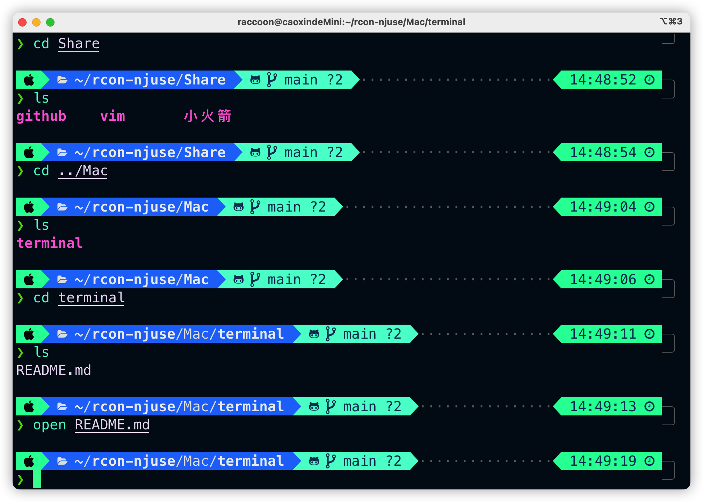
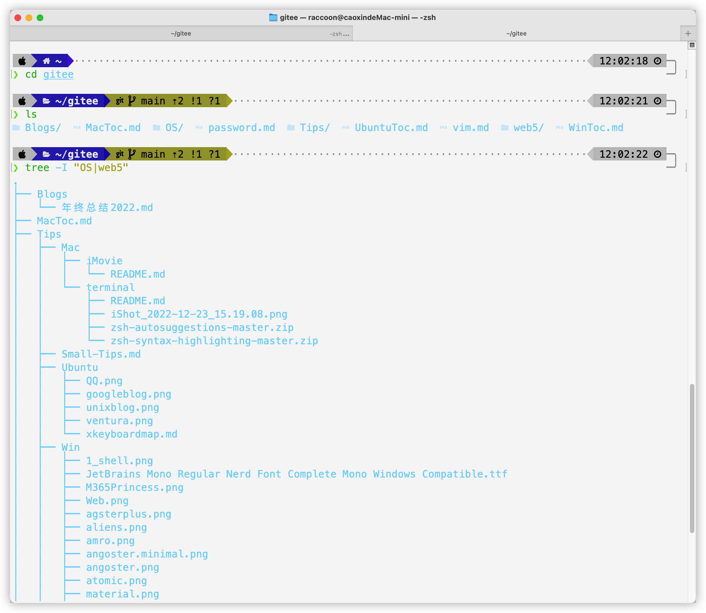

# 这里开始终端美化

## 参考博客

https://blog.csdn.net/weixin_42326144/article/details/121957795

https://www.youtube.com/watch?v=GWutsiTwpqs&t=9s

https://www.youtube.com/watch?v=CF1tMjvHDRA

## 过程

- 首先是用iterm2代替terminal

- 安装好iterm之后安装ohmyzsh

- 在`~/.zshrc`中设置主题`ZSH_THEME=""`

- powerlevel10需要下载到`~/.oh-my-zsh/custom/plugins`

- 然后更新配置

```sh
  source ~/.zshrc
```

```sh
  p10 config #配置p10的外观
```

- 配置plugins(高亮,补全,web-search等)
- 导入itermcolors颜色配置文件

## Undo

终端和finder的双向打开

终端到finder可以通过

```sh
open $PATH #PATH可以复制prompt里的
```

finder到终端可以通过

```sh
cd $PATH #PATH通过复制文件夹来实现
```

## View




## 2. 回归terminal

==2023.1.4==

设置了字体之后又回归teminal了

因为默认文件夹打开ternimal

但是terminal仍然可以使用zsh

清除开启提示:

```sh
ZSH_DISABLE_COMPFIX="true"
```

view:



安装了logo-ls 和tree命令

```sh
brew install tree
```
