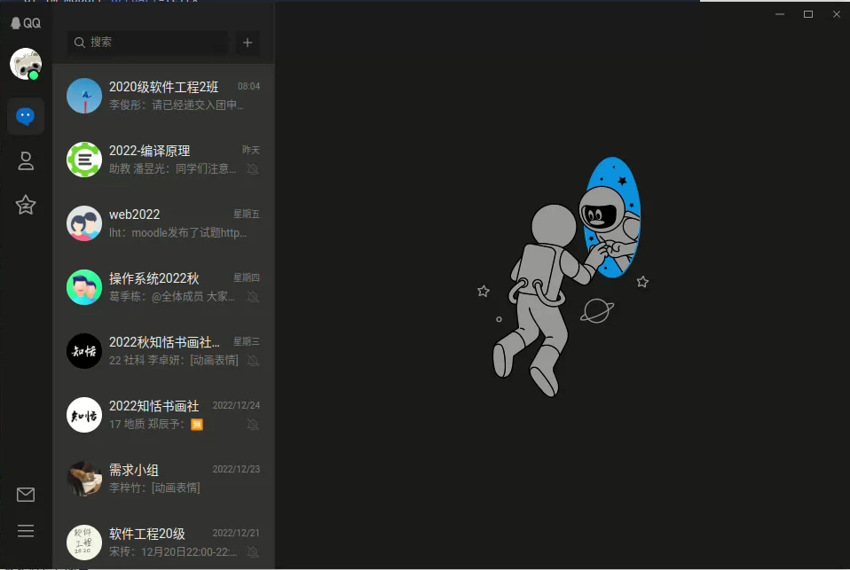
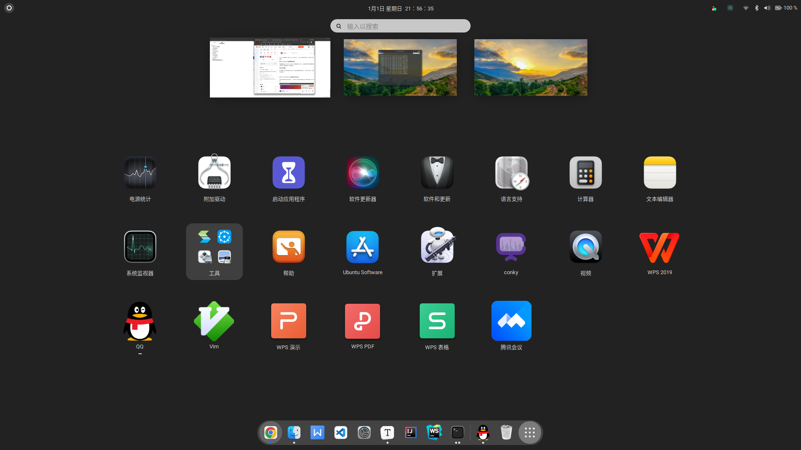

# Ubuntu Toc
[TOC]

## 1. 设置Gitee免密登录

按照gitee教程生成公钥再连接即可

但是今后clone时候要使用ssh方式了

可以更改`.git/config`实现https转ssh

## 2. vim配置相关
caps和escape互换[教程dconf-editor](https://blog.csdn.net/weixin_41995541/article/details/100222437)

`~/.vimrc:set number & syntax on`

## 3. 设置logo-ls

参考[教程](https://github.com/Yash-Handa/logo-ls#recommended-configurations)

然后

```sh
~/.bashrc
alias ls='logo-ls'
```

## 4. Clash命令添加

```sh
vim ~/.bashrc

#add alias
alias clash='cd ~/Clash && ./clash -d .'
:wq

source ~/.bashrc
```
也可以这样:

```sh
[[ -f ~/Clash/clash ]] && cd ~/Clash && ./clash -d .
```
## 5. 美化终端

https://blog.csdn.net/weixin_44520133/article/details/97110223

> 字体只能使用SpaceMono Nerd Font

```sh
git clone https://github.com/ryanoasis/nerd-fonts.git --depth 1 
```

> 记得在`~/.zshrc`中添加`./bashrc`对应的命令alias

**vscode**:

```json
"terminal.integrated.fontFamily": "SpaceMono Nerd Font",
```

## 6. 自定义键位
这个过程折腾了很长时间

有一个软件层面的方法是xmodmap

但是出现很多问题, 比如说在修改了对应的keycode之后, 原先的按键功能没有消失

学习xmodmap:archwiki搜索即可

硬件层面:[X keyboard extension](https://wiki.archlinux.org/title/X_keyboard_extension#top-page)

参考[教程](https://blog.csdn.net/weixin_43417697/article/details/103717890)

修改`/usr/share/X11/xkb`中的pc和us文件

这一步比较危险, 一定要先备份

> **Undo** 只能在终端生效, 回头看看xkb官方文档再试试吧

==2022.12.31报喜: 消灭bing暴政, 世界属于google==

根源上解决了键盘映射自定义键位问题, 详情请见[ubuntu键盘映射终极方案](./Tips/Ubuntu/xkeyboardmap.md)

==问题2023.1.1==

重新安装输入法之后似乎caps+hjkl受到了一些干扰

先尝试重新装一下

不知道怎么的又好了

是先把altgr_vim里面的iso换成mode

然后再换回来

但是现在xev里面依然是显示caps为mode

不过功能没有问题

caps原本的大写功能也成功取消不亮


## 7. 一些意外情况

草泥马今天怎么突然extensions出问题

然后搜狗输入法不能用

然后ibus智能拼音被卸载了

然后花了我一下午

全尼玛在配置输入法

草泥马

不想写过程了

下次在遇到就砸电脑吧

==修复：2023.1.1==

尝试了一个教程：在`~/.pam_environment`中添加：

```sh
GTK_IM_MODULE DEFAULT=fcitx
QT_IM_MODULE DEFUALT=fcitx
XMODIFIERS DEFAULT=\@im=fctix
```

## 8. snap安装idea

因为不想配置desktop，不想用官网的jar包

但其实可以在idea里面选择创建桌面快捷方式

snap安装方式：

```sh
sudo snap install webstorm --classic
```

小错误：`/ has 'ohter' writter 40777`

原因是根目录的权限超了，要恢复成755权限

## 9. 安装QQ

他真的 我哭死

在2022年底还更新linux QQ

是不是十几年没更新了

话不多说看看效果



竟然还有截图功能`Ctrl+Alt+A`

于是我把火焰截图删了, 把对应的系统快捷键也删了

但是坏处就是有一点点耗内存

## 10. 闲来无事的继续美化gnome

icons + albert

`Albert`是类似于MacOS的 Spotlight 启动器

安装: [下载网址](https://software.opensuse.org/download.html?project=home:manuelschneid3r&package=albert)

dpkg安装即可

期间可能会有依赖问题

```sh
sudo apt --fix-broken install
```

> **Undo** 有一个怪怪的情况，只有打开了一个窗口才能全局访问，而且终端,finder之类的还不算 可能是gnome的问题

==2023.1.2重新尝试 更新软件源安装albert==

```sh
echo 'deb http://download.opensuse.org/repositories/home:/manuelschneid3r/xUbuntu_22.04/ /' | sudo tee /etc/apt/sources.list.d/home:manuelschneid3r.list
curl -fsSL https://download.opensuse.org/repositories/home:manuelschneid3r/xUbuntu_22.04/Release.key | gpg --dearmor | sudo tee /etc/apt/trusted.gpg.d/home_manuelschneid3r.gpg > /dev/null
sudo apt update
sudo apt install albert
```

结果打不开

再次尝试deb包安装 失败

icons:

发现一个好看的ikun[网址](https://linux.cn/article-12361-1.html)

- [McMojave-circle](https://www.gnome-look.org/p/1305429/)
- [Mojave CT-icons](https://www.gnome-look.org/p/1210856/)
- [Cupertino icons](https://www.gnome-look.org/p/1102582/)

`/home/raccoon/.local/share/icons/`是所有icon地址

小tip：`ctrl + l`显示路径

这个ventura还蛮好看的, 紧跟时代潮流！尴尬的是把tweaks和settings设置成了一样的图标



extensions:

对于已经不支持的插件，可以dconf-editor，在配置工具中kkkkkkk导航到“ *org/gnome/shell* ”，然后打开“disable-extension-version-validation”的滑块图标。

extension文件夹：`~/.local/share/gnome-shell/extensions/`

## 11. 尝试不同的Ubuntu桌面环境
```sh
sudo apt install kubuntu-desktop
sudo apt install lxde
sudo apt install xfce4
```

[详细文件](./桌面环境.md)

切换默认桌面环境：

```sh
1. 查看当前系统安装了几个桌面
ls /usr/share/xsessions

2. 修改配置文件
sudo vi /usr/share/lightdm/lightdm.conf.d/50-ubuntu.conf
里面的一行
user-session= 
```
