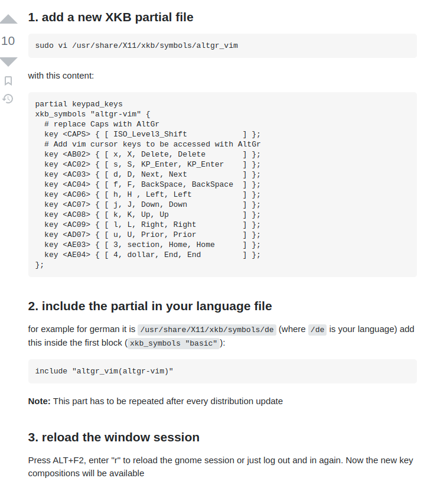
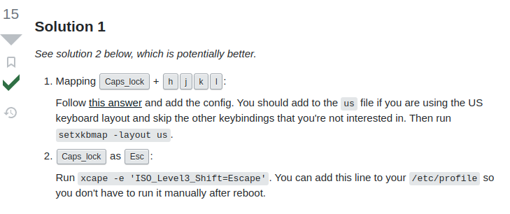

# Ubuntu键盘映射终极方案

## 参考教程==google是我爹==

[1](https://askubuntu.com/questions/684459/configure-caps-lock-as-altgr-and-arrows-like-in-vim/898462#898462)



[2基本不用看](https://unix.stackexchange.com/questions/414926/bind-capshjkl-to-arrow-keys-caps-to-esc)



## 基本步骤

### 1. 创建altgr文件

```sh
sudo vi /usr/share/X11/xkb/symbols/altgr_vim
```

我的配置:

```c
partial keypad_keys
	xkb_symbols "altgr-vim" {
	  # replace Caps with AltGr
	  key <CAPS> { [ ISO_Level3_Shift, Escape    ] };
	  # Add vim cursor keys to be accessed with AltGr
	  key <AC03> { [ d, D, BackSpace, BackSpace  ] };
	  key <AC06> { [ h, H , Left, Left           ] };
	  key <AC07> { [ j, J, Down, Down            ] };
	  key <AC08> { [ k, K, Up, Up                ] };
	  key <AC09> { [ l, L, Right, Right          ] };
	  key <AD08> { [ i, I, Home, Home            ] };
	  key <AD09> { [ o, O, End, End              ] };
	};
```

$$
CapsLock + h \ \rightarrow \ Left
\\
CapsLock + j \ \rightarrow \ Down
\\
CapsLock + k \ \rightarrow \ Up
\\
CapsLock + l \ \rightarrow \ Right
\\
CapsLock + i \ \rightarrow \ Home 
\\
CapsLock + o \ \rightarrow \ End
\\
CapsLock + d \ \rightarrow \ BackSpace
\\
Shift + CapsLock \ \rightarrow \ Escape
$$

### 2. 在 `symbols/us`中添加配置

```c
default partial alphanumeric_keys modifier_keys
xkb_symbols "basic" {
    include "altgr_vim(altgr-vim)"
    name[Group1]= "English (US)";

    key <TLDE> {	[     grave,	asciitilde	]	};
    key <AE01> {	[	  1,	exclam 		]	};
    key <AE02> {	[	  2,	at		]	};
    key <AE03> {	[	  3,	numbersign	]	};
    key <AE04> {	[	  4,	dollar		]	};
    key <AE05> {	[	  5,	percent		]	};
    ...
};
```

第二行的basic模块中导入altdr即可

### 3. reboot 或者注销即可