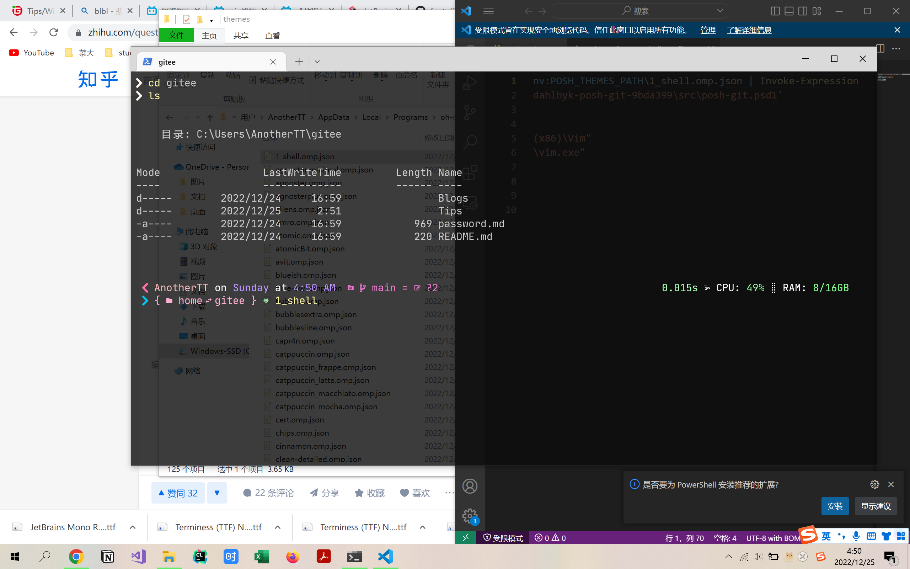
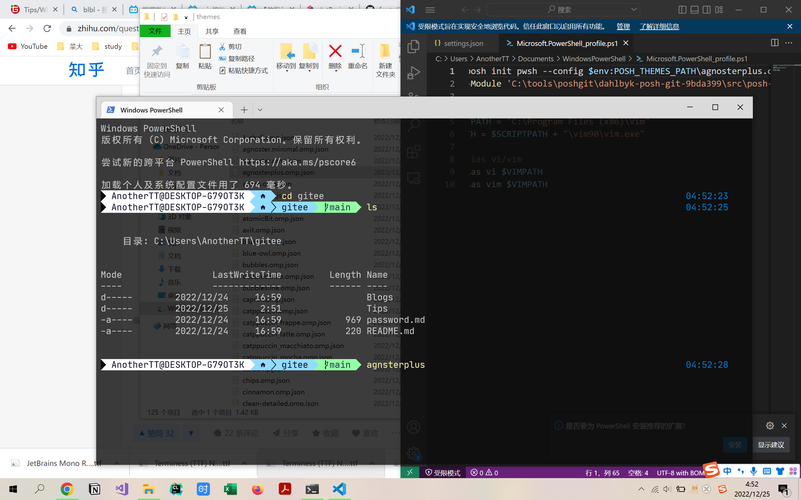
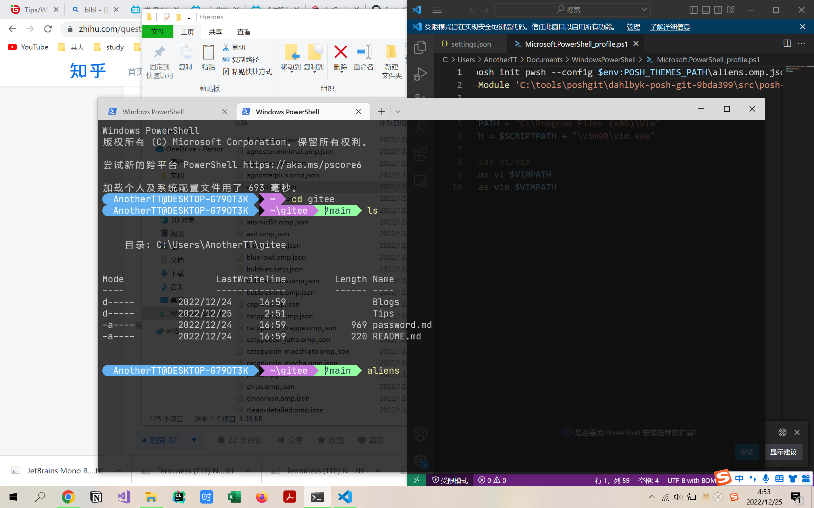
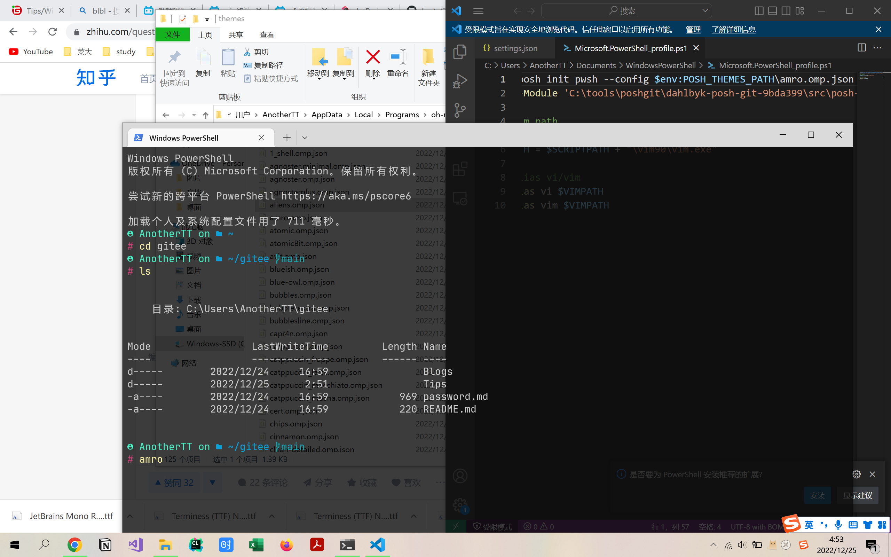
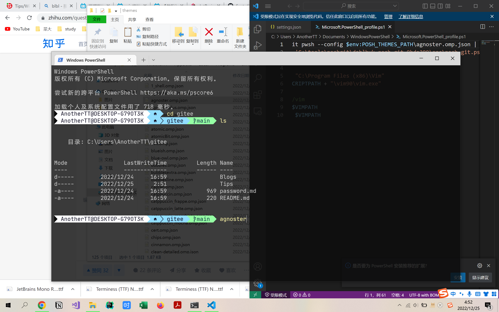
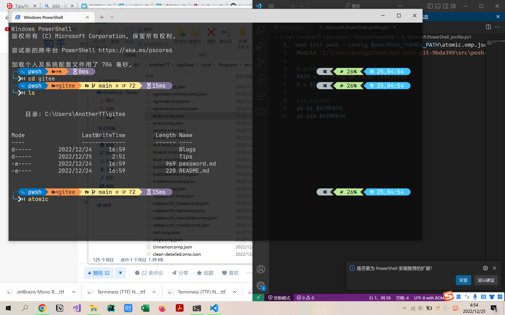
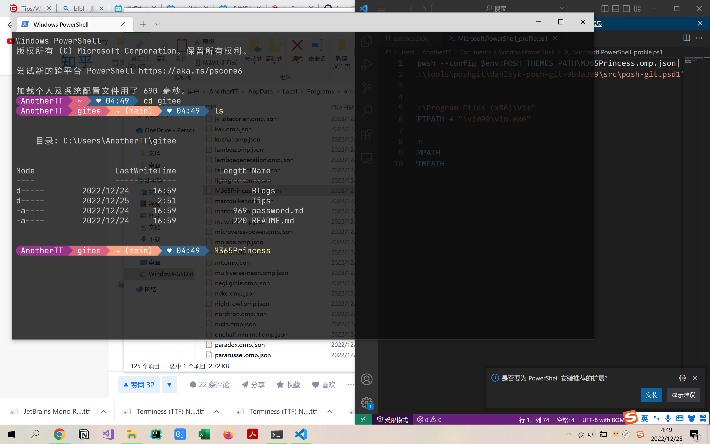
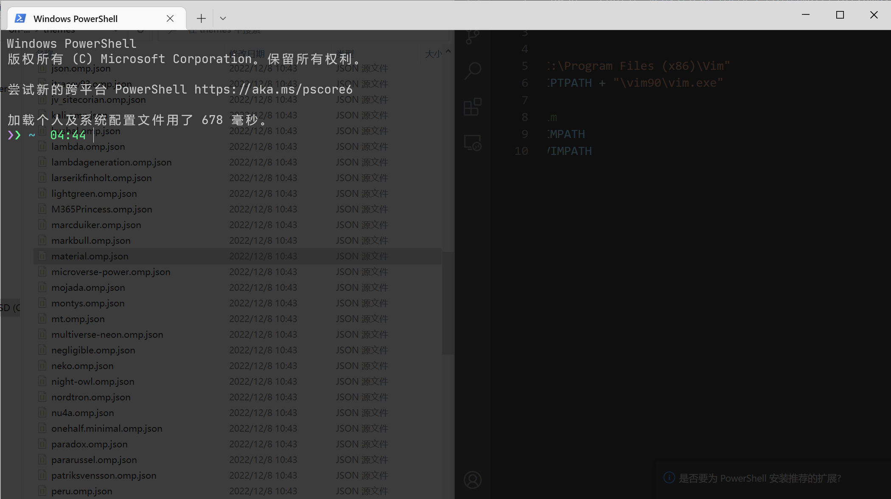
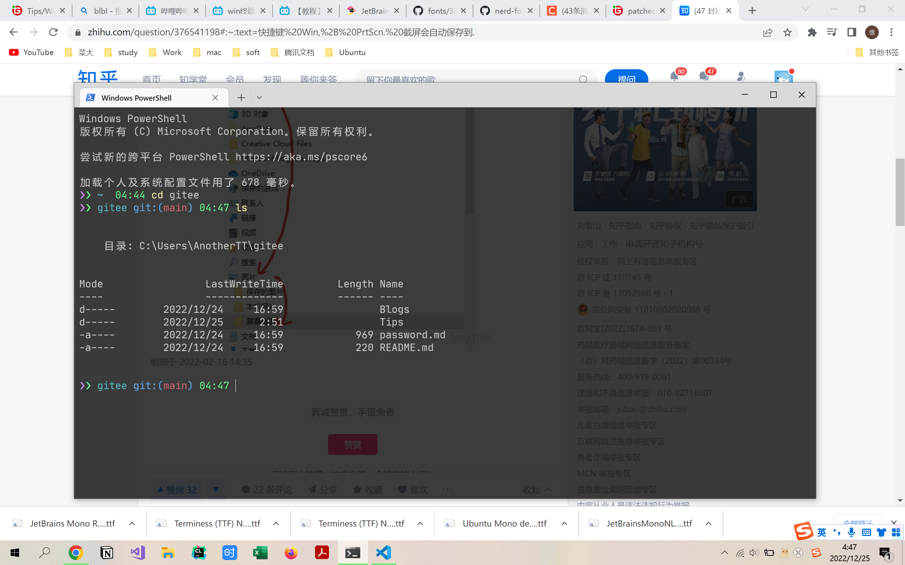
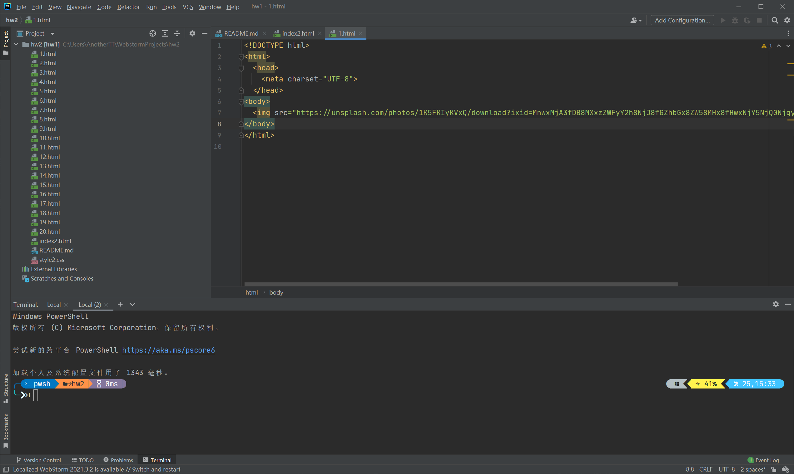

# win美化powershell全过程_Vim_git
## 1. 在powershell中使用git
参考教程：[1](https://www.jianshu.com/p/2b28ed7b3bc1)  [2](https://zhuanlan.zhihu.com/p/265903402) [3](https://blog.csdn.net/weixin_43760969/article/details/105940877)

- 知乎更管用

- 先安装Chocolatey

- 通过Chocolatey安装posh--git

- 添加环境变量 git\cmd & npm

- 关键点是 npm和git-posh

- powershell如何升级为管理员权限：`start-process wt -verb runas`

## 2. 在powershell中使用vim
参考教程:[1](http://www.mitgai.net/2016/04/windows/setup-vim-to-work-with-powershell.html#:~:text=%E9%85%8D%E7%BD%AE%20Vim%20%E4%BD%BF%E5%85%B6%E5%92%8C%20PowerShell%20%E4%B8%80%E8%B5%B7%E5%B7%A5%E4%BD%9C%201%201.%E5%AE%89%E8%A3%85%20Vim,vimrc%20vimrc%20%E6%98%AF%20vim%20%E7%9A%84%E9%85%8D%E7%BD%AE%E6%96%87%E4%BB%B6%EF%BC%8C%E4%BF%9D%E5%AD%98%E5%9C%A8%20vim%20%E7%9A%84%E5%AE%89%E8%A3%85%E7%9B%AE%E5%BD%95%E4%B8%8B%EF%BC%9A%20) [2]()

- 安装vim

- 配置posh配置文件 profile `$profile`命令查看文件位置

- 修改配置文件添加：

```sh
#add vim path
$SCRIPTPATH = "C:\Program Files (x86)\Vim"
$VIMPATH = $SCRIPTPATH + "\vim90\vim.exe“
 
#set alias vi/vim
Set-Alias vi $VIMPATH
Set-Alias vim $VIMPATH
```

- 修改vim配置：在安装目录下找到`_vimrc`文件，然后[赋予权限](https://blog.csdn.net/changyana/article/details/118686463)
```sh
syntax on 高亮
set number 行号
set noundofile 不生成un~撤销备份
set nobackup 不生成~备份
```

## 3. 更改按键映射：PowerToys
应用商店安装，选择键盘映射即可

后台不能关闭

## 4. 开始美化：

参考教程[1](https://www.bilibili.com/video/BV1Qa411T7Au/?spm_id_from=333.337.search-card.all.click&vd_source=9fc1aeab20d64d4315c451b9c18d30d8) [2最后有关于json主题文件的讲解](https://www.bilibili.com/video/BV1Pq4y1g7os/?spm_id_from=333.337.search-card.all.click&vd_source=9fc1aeab20d64d4315c451b9c18d30d8)

- 安装`winget`: 微软商店搜索"应用安装程序" 更新 
- `winget install oh-my-posh `安装oh_my_posh
- 修改Powershell 的 `$PROFILE`：

```sh
oh-my-posh init pwsh --config $env:POSH_THEMES_PATH\montys.omp.json | Invoke-Expression
```

- 修改WindowsTerminal的json设置：

```sh
设置->打开JSON文件
```

- 在json中的default中添加：

```json
"useAcrylic": true, 

"acrylicOpacity": 0.2

"backgroundImage": "URL", 
"backgroundImageOpacity": 0.4
"fontFace": "XXX", 

"fontSize": 14
```

> **Unsolved: **亚克力效果回不去了, 导致没有办法看清PSReadLine补全的命令
>
> **Unsolved: **字体目前只能支持Nerd相关字体, 推荐[JetBrains Mono Regular Nerd Font Complete Mono Windows Compatible](./JetBrains Mono Regular Nerd Font Complete Mono Windows Compatible.ttf)

- 如上, 安装Nerd字体, 然后在设置里选择即可, 否则会有乱码

- 挑选主题[主题官网](https://ohmyposh.dev/docs/themes)

```sh
C:\Users\$User\AppData\Local\Programs\oh-my-posh\themes
```

- 1_shell

- agsterplus

- aliens

- amro
- agoster
- atomic
- M365Princess
- material
- 一个简单的主题

## 5. 安装PSReadLine插件

- 由于powershell自带命令高亮, 所以只安装补全插件即可

```sh
Install-Module PowerShellGet -AllowClobber -Force #安装get模块
Install-Module PSReadLine
Set-PSReadLineOption -PredictionSource History
```

- 出现各种奇奇怪怪的参数缺失直接google
- 有一个问题最后解决方法是:

```sh
Get-Module RSReadLine #显示安装路径, 把旧版本删掉即可
```

## 6. 在Webstorm中调用终端

- 更改调用的终端程序位置

```sh
File->Settings->Tools->Terminal->Shell path
C:\Windows\System32\WindowsPowerShell\v1.0\powershell.exe
```

- 更改powershell的字体

```sh
在打开的 Windows PowerShell 快捷方式文件上右击鼠标，选择“属性”。 在属性窗口中切换到“字体”选项卡。 然后，将字体设为你喜欢的某种字体，将字体的大小设为你觉得合适的大小。 再点击切换到“颜色”选项卡，并选择“屏幕文字”。
```

- [添加字体](https://www.cnblogs.com/Wj-yuki/p/15128744.html#:~:text=IDEA%E4%BB%8E%E5%A4%96%E9%83%A8%E6%B7%BB%E5%8A%A0%E6%96%B0%E5%AD%97%E4%BD%93%20Step1%EF%BC%9A%E5%B0%86%E4%B8%8B%E8%BD%BD%E5%A5%BD%E7%9A%84%E5%AD%97%E4%BD%93%E6%94%BE%E5%88%B0IDEA%E7%9A%84%E5%AE%89%E8%A3%85%E7%9B%AE%E5%BD%95%E4%B8%8B%20D%3A%5CProgram%20Files%5CJetBrains%5CIntelliJ%20IDEA%202019.3.3%5Cjbr%5Clib%5Cfonts,Step2%EF%BC%9A%E5%9C%A8IDEA%E4%B8%AD%E8%AE%BE%E7%BD%AE%EF%BC%9Afile%20--%3E%20settings%20--%3E%20editor%20--%3Efonts)

- 预览
