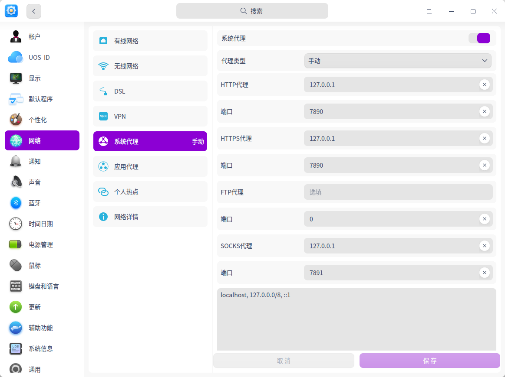

# 统信系统操作教程

uos yyds!

新手请看[pdf文件](./uos简明教程（新手向.pdf)

## 1. 关于双系统安装
ventory真的很好用，直接插入u盘，打开ventory.exe, 就可以格式化这个u盘
然后变成一个启动盘, 直接往里面拖iso镜像即可安装, 非常好用

第一个问题是, u盘读取

在boot引导的时候出现了安全启动错误, 后来在bios关闭了安全启动即可正常引导

然后就是正常的安装系统

点击自动安装会主动检测硬盘并自己进行分区

我之前在win里面分出来一段120g的区域, 在win里面剪裁卷必须得连续内存才行

难道是为了防止内存碎片?

第二个问题是, 启动询问引导

直接二话不说给我跳win

后来在bios里面禁止了快速启动，把硬盘启动的优先级给到了uos，解决

如果把硬盘优先级给到win好像还是不会询问（联想电脑的现象）

## 2. Wifi 功能缺失

搜教程让重装wifi驱动

```sh
sudo apt-get install linux-firmware
```
但是我执行的时候报了锁错误, 之后重启就出现wifi了

因此又有了另一段教程

---

菜鸟解决方案：
下载链接（[UOS网卡(有线/无线)问题的解决方法－统信UOS官方论坛 (chinauos.com)](https://bbs.chinauos.com/zh/post/9926)）中高通的附件并解压，随后按照链接（[uos命令_UOS如何以管理员身份编辑带锁的文件/文件夹_缪之初的博客-CSDN博客](https://blog.csdn.net/weixin_42134240/article/details/112147168)）方法打开目标文件夹，

即在开发者模式开启后，使用超级用户密码，在终端中输入 **sudo dde-file-manager** /lib/firmware/ath10k/QCA6174/hw3.0/

然后将附件文件夹中的文件拷贝进目标文件夹覆盖，即board复制并覆盖所有board文件，删除原文件夹内board.bak，重启即可联网。

---

## 3. 开发者模式

需要在设置中打开开发者模式才能在终端sudo passwd

==终端sudo的问题==

这个是我傻逼

进入root用户和sudo操作的密码并不一样

## 4. gitee

重新配置ssh，在gitee中添加新的ssh密钥，命名为uos，其实可以复制ubuntu的密钥文件到uos中，但是有点麻烦，不如直接新建密钥比较好

## 5. ssh远程链接

因为显示屏损坏的原因，尝试使用ssh连接远程桌面解决

未果，寻病终，后遂无问津者。

上面这句话的打字体验让我意识到还是需要一个搜狗

ssh和rdp都失败了

其实remmina只是一个架子。里面要填充具体的协议

我之前用windows来访问mac应该是vnc协议，软件也是vnc的viewer

目前来看应该是向日葵最方便了

但是ip地址xorg不到真的难受，想解决问题。做学问也是要这样啊

## 6. clash

家人们，原来的clash配置网站被扬了，看来中国网安还是很nb的

其实比较简单了，首先在[资源包](../魔法)里面找到clash.zip

然后把clash文件赋予权限

```sh
sudo chmod +x clash
```

然后运行clash

```sh
./clash
```

然后就会自动生成`./config/clash`里面的两个文件,一个yaml一个mmdb,用资源包里面的替换即可

下面就是配置代理, uos代理在这里

之后就是`./clash -d .`

有几种方式自动代理，一种是nohup命令，一种是service服务

扔个教程下次搞 [1](https://zhuanlan.zhihu.com/p/451863859) [2](https://zhuanlan.zhihu.com/p/598337110)[3](https://juejin.cn/post/7123100274171838495)

==安卓应用==必须关闭代理

## 7. 个性化

### ==动态壁纸==

在spark里面搜索幻梦动态壁纸即可

在uos商店里面下载的会导致桌面图标变大，右键菜单缺失

在spark里面下载的uos版会导致tab菜单图片消失

后来在官网上github下载了新版本就好了

但是真的耗内存，和cpu，我第一次见一个应用能把cpu占掉20，woc太猛了

后来想想要不拆分图片然后作为壁纸吧

于是就有了[projects](./projects/mp4tojpg/README.md)

但是呢，需要进行一个pycharm的安装，后来发现输入法显示有问题，于是在github的issues里面找到了解决方案，要[旧版本才行](https://github.com/RikudouPatrickstar/JetBrainsRuntime-for-Linux-x64/issues/36)

vscode其实也可以当做项目管理器的[参考](https://zhuanlan.zhihu.com/p/264861498)

 ### ==typora：==

使用了[lanyue主题](https://github.com/hh-lanyue/typora-theme-lanyue)，奇怪的是没有办法自动检测本地主题的文件夹(typora免费版)

文件夹在`~/.config/Typora/theme`

还出现了typora多个窗口在任务栏不统一的现象

付费版两个问题解决

估计免费版是哪里找的包套壳的吧

 ### ==icons==

今天打开了icons的大门，很多图标是通过软连接的方式连接到同一个图标，以应对同一个应用在不同地方出现的情况

一个很奇怪的现象,spotify的任务视图图标是xorg.svg,不知道怎么读取的

所有软连接到xorg的图标：

```sh
gnome-panel-force-quit.svg -> xorg.svg

kcmx.svg -> xorg.svg

mate-panel-force-quit.svg -> xorg.svg

pattern-x11.svg -> xorg.svg

xapp.svg -> xorg.svg

xdiagnose.svg -> xorg.svg

xinput_calibrator.svg -> xorg.svg
```

逐一更换都不行

后来我把这几个软连接全部链接到了xorg-old.svg然后把xorg链接到了spotify.svg

包括QQ也是tab图标很怪,不过QQ确实链接到了qq图标罢了

猜想:没有写绝对路径的desktop是直接到icon文件夹搜索名字的

 ### ==terminal:==

oh-my-posh

终于明白oh-my-posh干了什么了

先安装一个程序，然后赋予运行权限，然后下载主题json，然后在bashrc里面加默认启动的命令（里面可以调整主题），over

```sh
# 1. 下载 Oh my posh 64位版本，并导入到 /usr/local/bin/oh-my-posh 路径下
sudo wget https://github.com/JanDeDobbeleer/oh-my-posh/releases/latest/download/posh-linux-amd64 -O /usr/local/bin/oh-my-posh
 
# -> github 下载速度慢，可以参照网络上 github 加速方法，更换下载源
sudo wget https://github.91chi.fun/https://github.com//JanDeDobbeleer/oh-my-posh/releases/download/v7.61.0/posh-linux-amd64 -O /usr/local/bin/oh-my-posh
 
# 2. 为 oh-my-posh 添加运行权限
sudo chmod +x /usr/local/bin/oh-my-posh
 
# 3. 下载主题文件并解压，解压后添加读写权限，并清除原始压缩包
mkdir ~/.poshthemes
# -> github 下载速度慢，可以参照网络上 github 加速方法，更换下载源
wget https://github.com/JanDeDobbeleer/oh-my-posh/releases/latest/download/themes.zip -O ~/.poshthemes/themes.zip
unzip ~/.poshthemes/themes.zip -d ~/.poshthemes
chmod u+rw ~/.poshthemes/*.json
rm ~/.poshthemes/themes.zip
 
# 4. 更改主题
vi ~/.bashrc 
-> 添加如下代码
eval "$(oh-my-posh --init --shell bash --config ~/.poshthemes/我自己的主题.json)"
 
# 5. 安装NF字体，再次打开即可以使用。
```

因此回归zsh，因为可以使用插件

注意自己定义的ls和导入的PATH会有冲突的，应该放在PATH下面

关于我自己的zsh文件：

打开了shell的大门，写了一些函数，其实可以定义变量然后直接调用应用的

后来因为实在受不了为什么自带的终端识别不了我的那个上下左右，因此换成了Tilix终端

tilix需要进行一定的配置以保证能够读取当前路径

```sh
https://gnunn1.github.io/tilix-web/manual/vteconfig/
下面加在zshrc
if [ $TILIX_ID ] || [ $VTE_VERSION ]; then
        source /etc/profile.d/vte-xxxxx.sh
fi
```

### ==Xmodmap==

Ubuntu终极方案是可以直接套用的，只不过快捷键在设置里要重新配置一下，一键恢复默认即可

我还一度认为这个键盘被我整失灵了，他妈的吓鼠我了

坏了，上下左右在终端用不了,变成ABCDFH,真逆天

### ==panel==

比较曲折的过程，今天不知道在哪看到了那个，就是可以在bin目录底下直接运行看报错，然后就是发现qt版本不对，安装Qt版本，添加了lib_path，

然后显示xcb模块无法启动，添加了`export QT_DEBUG_PLUGINS=1`查看报错信息，新的报错信息是`libxcb-util.so.1 => not found`，结果解决方案是[this](https://blog.csdn.net/Fozei/article/details/116160454)

```sh
cd /usr/lib/x86_64-linux-gnu
sudo ln -s libxcb-util.so.0  libxcb-util.so.1
```

完了这样处理的话,在命令行可以启动panel了,但是icon还是不行

而且启动的很塑料啊,很窄,三个图标看不清，全屏就死机

然后退出之后最大最小化图标还没了,重装再调回来

可以尝试[源码安装](https://gbwater.top/p/deepin20%E7%BC%96%E8%AF%91%E5%AE%89%E8%A3%85dde-top-panel/#:~:text=%E5%AE%89%E8%A3%85dde-top-panel%201%20%E5%B0%86com.deepin.dde.toppanel.gschema.xml%20%E5%A4%8D%E5%88%B6%E5%88%B0%2Fusr%2Fshare%2Fglib-2.0%2Fschemas%202%20%E6%89%A7%E8%A1%8C%201%20sudo,%E6%96%B0%E5%BB%BA%E4%B8%80%E4%B8%AA%E6%96%87%E6%9C%AC%E6%96%87%E6%A1%A3%EF%BC%8C%E8%BE%93%E5%85%A5%E4%BB%A5%E4%B8%8B%E5%86%85%E5%AE%B9%EF%BC%9A%20...%206%20%E5%B0%86%E8%BF%99%E4%B8%AA%E6%96%87%E4%BB%B6%E7%9A%84%E6%89%A9%E5%B1%95%E5%90%8D%E7%94%B1.txt%E6%94%B9%E4%B8%BA.desktop%207%20%E5%B0%86%E8%BF%99%E4%B8%AA%E6%96%87%E4%BB%B6%E5%A4%8D%E5%88%B6%E5%88%B0~%2F.config%2Fautostart%208%20%E6%B3%A8%E9%94%80%E6%88%96%E9%87%8D%E5%90%AF%E6%88%96%E8%80%85%E7%9B%B4%E6%8E%A5%E5%8F%8C%E5%87%BB%E8%BF%90%E8%A1%8C)

因此不得不佩服dde-dock的优秀，dock和panel二合一

就是标题栏有点烦人，但是似乎可以[调整](https://blog.csdn.net/ysy950803/article/details/102492124)

### ==KDE settings==

dde部分借鉴于kde，因此可以利用kde实现一些标题栏主题、果冻效果、碎屏效果等等，但是标题栏属实不好用

### ==Yesplay==

首先是，没找到软件deb包，用rpm转换

`sudo alien ./yesplaymusic-0.4.7.x86_64.rpm`

`sudo apt install ./yesplay......deb`

其次，可以用apt直接搜索

`sudo apt install com.github.yesplaymusic`

### ==screenkey==

```sh
sudo apt install screenkey
```

键盘实时显示字幕

### ==视频相关==

显示视频信息：

```sh
ffmpeg -i 1.mp4
```

 ## 8. snap

```sh
sudo apt-get install snapd
snap install notion-snap
snap list //查看
snap run xxx // 运行
```

但是notion中文全是方框乱码，这个是我在ububtu上面没有遇到过的情况，so

```sh
sudo snap remove notion-snap
```

## 9. Spark

然后安装了星火应用商店

在星火应用商店里面安装了notion

但是notion无法从浏览器登陆appleid唤起，用的是github大神的包，后来从邮箱登陆了

## 10. 内核升级

本来是想解决没有声音输入设备的问题，但是升级内核有很多方法，姑且放两个方法在这里试试

https://bbs.deepin.org/post/202433

https://bbs.chinauos.com/zh/post/3495

https://bbs.chinauos.com/phone/post/9763

> ==boot杂谈==

在/boot/grub中,有一些很神奇的文件

比如我在安装内核之后,内核文件和内核初始化文件都会在里面

grub文件夹下的grub.cfg文件定义了引导菜单

可以自己编辑,切换回到原来的内核启动

https://bbs.chinauos.com/zh/post/11511

## 11. 中文输入

spotify和kdenlive界面无法输入中文的解决方案

```sh
sudo cp /usr/lib/x86_64-linux-gnu/qt5/plugins/platforminputcontexts/libfcitxplatforminputcontextplugin.so /opt/apps/org.kdenlive/files/bin/usr/plugins/platforminputcontexts/
```

也可以到kdenlive官网选择flatpak方法安装

## X. 一些缺陷

chrome密钥环，直接删了吧，不管用，最后解决方案是把登陆密钥环密码也设置成空的

chrone无法变换窗口大小我真的谢

chrome中间还有细线

无论是应用商店还是deb包都不行

第三工作区预览图没有背景

HDMI音频设备检测不到

腾讯会议wine版本检测不到麦克风，开摄像头卡卡的

不过腾讯会议app版本可以共享uos桌面倒是很厉害的

微信安卓输入法会有点问题，换个聊天框解决

> Xmodmap

本来是OK的，但是后来发现shift+caps修饰键容易错乱

> ==wine==

AppleMusic和itunes用不了

`music在线版解决，其实也是套壳`

itunes后来在spark缓存`/tmp/spark-store`里面手动安装即可,记住要用apt安装!dpkg不会自动处理依赖的,但是用起来卡卡的itunes

> ==Spotify==

无法输入中文，wine版本的微信也会出现这个问题，但是换个聊天框就可以解决

> 蓝牙问题

官网有临时解决方案


竟然真的被我弄成功了，现在，键盘2号蓝牙为uos，鼠标默认uos链接，非常舒服

> ==声卡==

远舰盘在微星上运行，腾讯会议视频和音频检测良好，wine和安卓都良好

初步判断是yoga对uos声音适配问题，可能就是检测不到麦克风阵列，驱动不适配

输出音频问题：旧版音箱检测不到，HDMI康佳检测不到，估计驱动不适配

蓝牙鼠标在微星远舰盘上依旧是连上了但是不能用，说明不是硬件蓝牙的问题，还是驱动适配问题

`解决方案`

https://bbs.chinauos.com/phone/post/9763

更新一下alsa驱动，然后重启即可,非常简单

> 文件搜索，中文输入

很奇怪的一件事情就是在/usr/share/spotify文件夹里面搜不到任何文件

spotify的中文输入问题没有像kdenlive那样一下子解决掉，单纯复制so文件不管用

==触控板==

睡眠状态下容易失灵，解决方案是再次睡眠.....

## O. 大对比：


一个bug：xuwei账号和chb账号都打开不了蓝牙，即内置uos打开不了蓝牙模块，应该不是维修的问题

上面这个问题解决了。

下一个bug：数据线经常断连，很奇怪。


## P. 内置化艰辛历程

为了防止供电断连，遂内置

时间从2月2日中午到2月3日中午

### 尝试1.1

直接更换硬盘，到了店里才发现两个硬盘一个是M2mkey 一个是M2 bkey

理论上是可以装上bkey的，但是联想bios阉割严重，遂放弃。

### 尝试1.2

交换分区数据

U盘装入启动PE系统，利用ghost先把ssd的ubuntu分区转到umate的空闲分区，然后再整理ssd空间，安装uos

结果是，复制老失败，用ubuntu的cp命令也是失败。用diskgenius的克隆速度很慢，后来和黄钰涵聊天过程中竟然速度快了。

结果是复制到umate分区的ubuntu并不能boot启动，很难过，留下了一堆启动不了的数据，但有存根总比没存根好，说不定哪天重装一个ubuntu就能把数据恢复过去了

### 尝试1.3

于是就开始整理ssd空间了，用U盘和umate做媒介，目前的存储是，原ssd的`movies`和`jianpiandownload`文件夹在_dde_data的`.windowsbak`文件夹

原来的Documents中wechatfile和tencentfile在umate区,但是,但是在传输过程中出现了一些意外情况,因为一开始是剪切复制到u盘,但是中途被我取消了,但是我直接吧已经传输的删了,但是没有放进回收站而是直接赋了清楚位,于是我又得走上漫长的数据回复道路了.

众所周知免费的数据恢复软件是不存在的,收费的都是百元起步.初步扫描了一下,重要的文件有腾讯会议的几次录屏和微信的backup备份,然后尝试了各种方式,pandora,淘宝,drill……

反正挺烦的，drill可以但是只能500M，国内的什么，失易得，数据精灵，那就不用想了，diskgenius要钱的

后来还是recuva救我大命，目前恢复文件在umate的新建文件夹2中

### 尝试2.1

睡觉，在等待数据恢复的过程中睡着了。2点睡到7点，醒了躺床上继续睡

膀子麻麻的，口水香香的。

### 尝试2.2

早晨起来发现数据恢复可以了，就开始分区整空间了。

首先ubuntu92.1gb是被我直接扬了的。

然后383gb盘是可以空出不少，毕竟系统只剩154gb

然后先分出一百多，留下256，本来是想双系统都256的

好，精彩的部分来了。不作不死说的就是我

因为有backup区，所以并不是严格的256+256，而是256+221（477）

然后然后，最最精彩的来了，我总想把他变成221+256，于是准备再分区。

然后呃呃，然后就，，，，，，，，，，，，，，，失败了。。。簇有问题

我切换到win准备用磁盘管理器强制转，但是emmmm，显示没有可用空间（是能检测到可分区空间但是执行过程中报错没有足够的空间）

然后继续切换到PE，哈哈，用chkdsk命令修复簇，然后在PE里面继续执行分区，然后，，，分区卡了。。。然后我就强制重启呗，然后windows启动不了了。然后的然后，回到PE里面一看，256变成空闲空间了，原来的数据没了，cnm

好在保持了理智，重新扫描了分区，保存了分区表，用PE中win引导修复修复了efi引导，继续重启，windows可以使用了。

后来嘛，在win里面分区就再也显示不了有效空间了。显示整个磁盘沾满了。而在uos中显示256依然空闲，且访问不了windows中的文件。

好在双系统都正常可用，这是最后的底线了。

估计还是簇或者磁道的问题吧，这属于硬件层面，需要我继续学习请教大佬才能解决。

记录在这里以便后期有机会解决这个问题

也有可能在还没有解决的时候我就换电脑了。O(∩_∩)O哈哈~

### 尝试3.1

速通uos，结果是没什么影响的，基本上照着这份文件都OK


## Q. 机房电脑新时代

把windowsbak复制到了mypassport的影视

把windows下载和tencent文档复制到了win备份里面的win文件里

想把ubuntu扬了，换成arch或者manjaro或者mint
